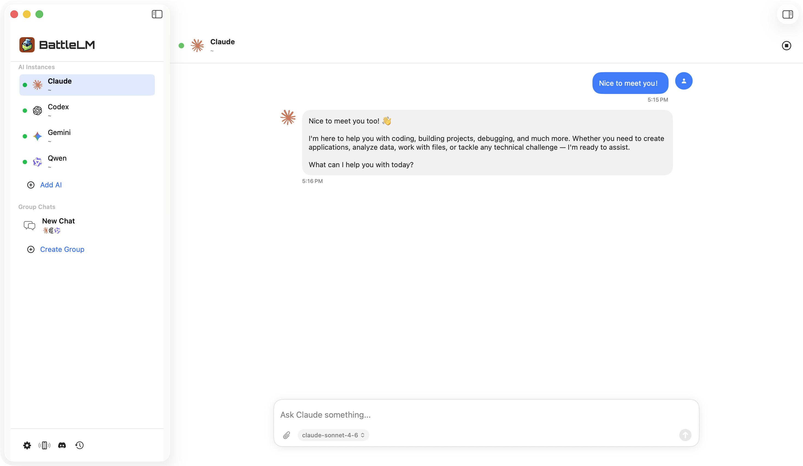
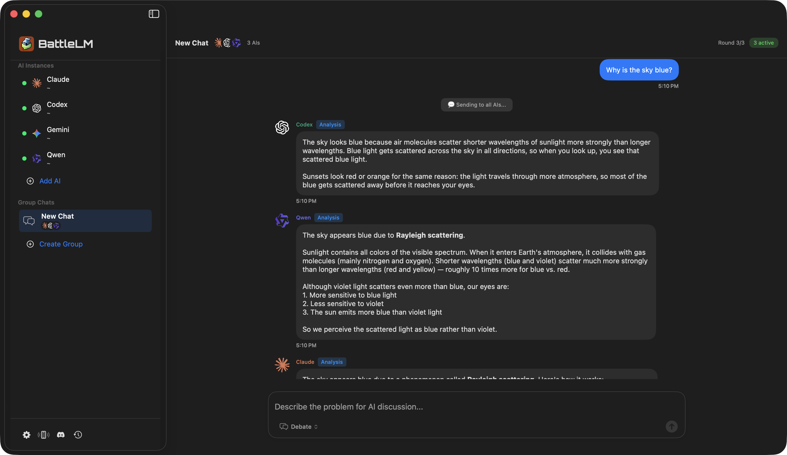
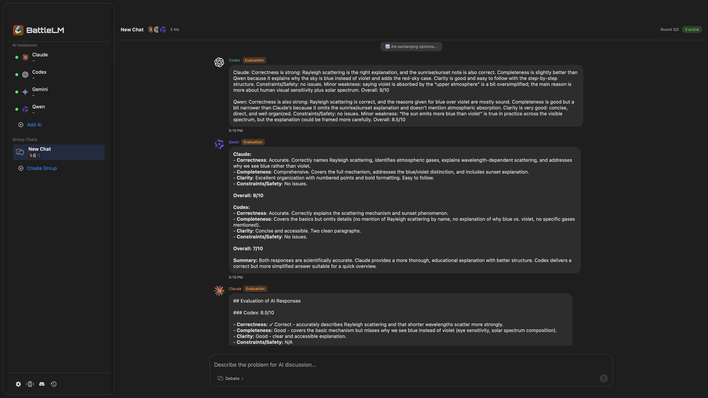
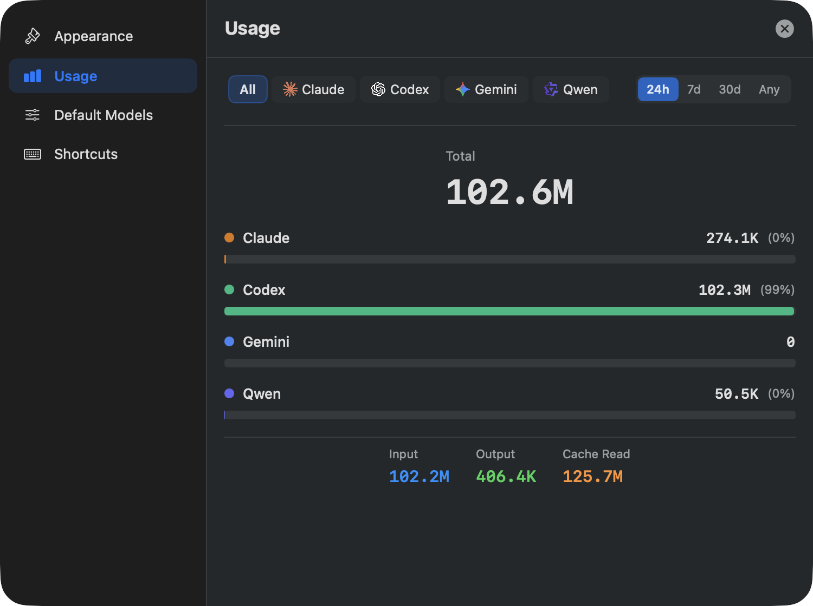
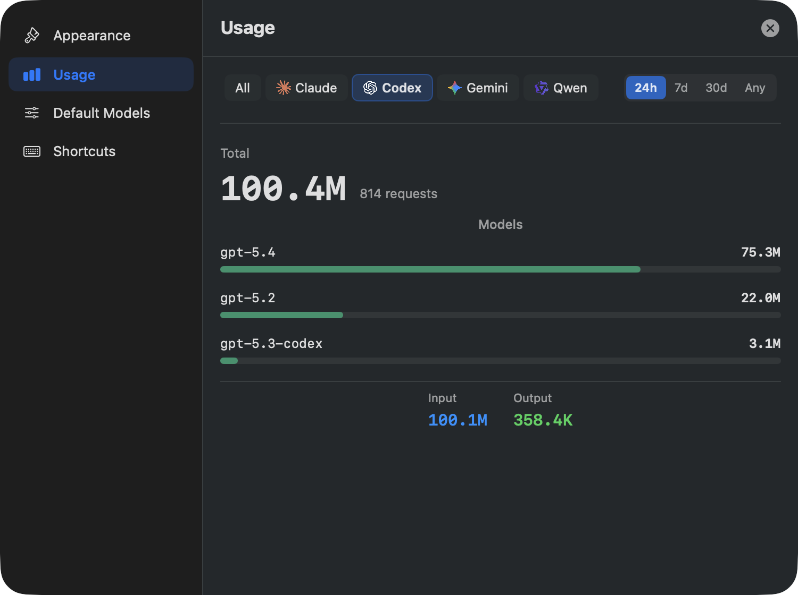

# BattleLM

BattleLM is a native macOS app for running multiple AI coding agents side by side, chatting with them one-on-one, and letting them discuss problems together in group chats.

It currently focuses on:

- Native macOS desktop experience
- Local AI CLIs such as Claude, Gemini, Codex, and Qwen
- Group-chat workflows for comparing answers and debating solutions
- iPhone pairing for remote access to your AI instances

## What It Does

- Create multiple AI instances with separate working directories
- Chat with a single AI in a clean 1:1 view
- Create group chats and let multiple AIs respond to the same problem
- Choose model variants, including second-level reasoning effort where supported
- Pair your Mac with iPhone through a QR flow

## Screenshots

### 1:1 Chat on macOS

### Group Chat on macOS

### Group Debate / Exchange on macOS

### All Usage Stats

### Provider Usage Stats

## Requirements

- macOS
- Xcode for local development
- At least one supported AI CLI installed and logged in

Supported providers in the current app:

- Claude
- Gemini
- Codex
- Qwen

## Install AI CLIs

BattleLM works with locally installed AI CLIs. Typical examples:

- Claude: `claude`
- Gemini: `gemini`
- Codex: `codex`
- Qwen: `qwen`

If a CLI is installed but not authenticated yet, BattleLM will detect that and show it as not fully ready.

## Build From Source

1. Open `BattleLM.xcodeproj` in Xcode.
2. Select the `BattleLM` scheme for macOS.
3. Build or Archive from Xcode.

The repository also includes an iPhone companion target:

- `BattleLM-iOS`

## Typical Workflow

1. Add one or more AI instances.
2. Choose a working directory for each instance.
3. Start with a 1:1 chat or create a group chat.
4. Compare responses, iterate, and switch models when needed.
5. Pair with iPhone if you want mobile access to the same remote host.

## Releases

Releases are intended to ship notarized macOS builds.

Current release assets use the macOS DMG format, for example:

- `BattleLM-macOS-1.0.3.dmg`

## Project Status

BattleLM is currently centered on the native macOS app and its iPhone companion. The old cross-platform desktop packaging line is no longer part of the project.
